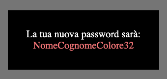

# Password Generator

## Testo della consegna
Chiedere all'utente:
- [ ] *Nome*;
- [ ] *Cognome*;
- [ ] *Colore Preferito*.

Successivamente, scrivere sulla pagina: **nomecognomecolorepreferito21**

### Bonus
> Al posto del 21 finale, generare un numero intero random (tra 0 e 100) usando la funzione Math.random() e le relative funzioni di arrotondamento.
Cercare documentazione su w3schools.

### Svolgimento
1. Raccolta dati:
    - [ ] Chiedere nome;
    - [ ] Chiedere cognome;
    - [ ] Chiedere coolore preferito;
    - [ ] Generazione numero casuale tra 0 e 100.
2. Esecuzione Logica:
    - Creazione della password concatenando i valori di nome, cognome, colore preferito.
3. Output:
    - Stampa della Password in pagina.

### Antemprima

